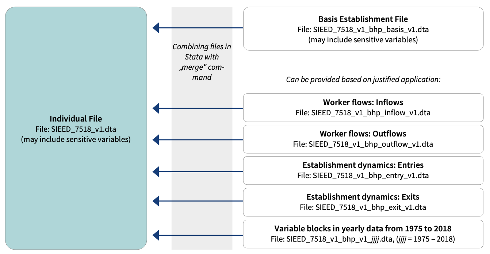
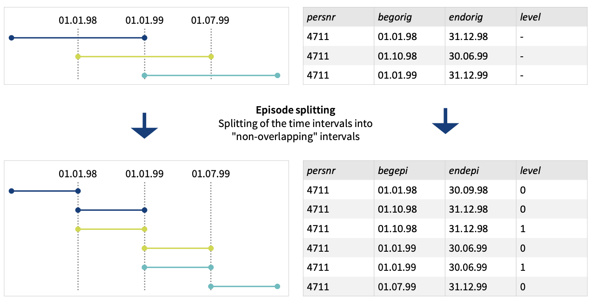

RA Luis Zapata - PHD Luca - Anderson School of Economics
================

## Explanation of Code

I will be utilizing matched employer-employee data from Germany. In this
[link](https://fdz.iab.de/en/int_bd_pd/the-sample-of-integrated-employer-employee-data-sieed-sieed-7518-version-1/),
you can find a description of the dataset. Specifically, there is a file
at the link containing a detailed description of the data
([this](https://doku.iab.de/fdz/reporte/2020/DR_14-20_EN.pdf)) and the
test data, which is a fake data. Unfortunately, access to the real data
is restricted due to confidentiality constraints associated with the
dataset.

This [paper](https://davidcard.berkeley.edu/papers/QJE-2013.pdf) is an
excellent piece that utilizes the same dataset, implementing certain
methodologies and approaches that I aim to replicate or use as a
foundation for my analysis. Additionally, the paper discusses some
issues with the dataset, including the fact that wages are capped. When
wages exceed a specific threshold, they are recorded as the threshold
value. The authors employ a methodology to estimate the actual wage
beyond the threshold, and I plan to adopt a similar approach. The
initial task will involve replicating their code, translating it into
either R.

## Data Sets managment

<div class="figure">


<p class="caption">
A caption
</p>

</div>

The documentation containts information about the datasets that contain
yearly data and those that involve worker flows and establishment
dynamics such as entries, exits, inflows, and outflows. Here is a
breakdown:

1.  **Datasets with Years in Their Name**: These datasets are annual
    files that contain variable blocks with data from each year from
    1975 to 2018. They are named using the format
    `SIEED_7518_v1_bhp_v1_jjjj.dta`, where `jjjj` represents the
    specific year (e.g., `1975`, `2016`, etc.). Each file corresponds to
    a particular year and includes data up to the reference date of June
    30th for that year. These files provide data specific to each year
    and can include both individual and firm-level information, focusing
    on the characteristics and dynamics relevant to that particular
    year.

- **Basis Establishment File (`SIEED_7518_v1_bhp_basis_v1.dta`)**:
  Contains aggregated information of the estabilishment place of work
  and economic activities. Contains the establishment number, the year,
  and aggregated variables about the place of work and economic
  activities as of the reference date, 30 June. It is meant to be linked
  with the Individual File for comprehensive analysis.

- **Individual-level File (`SIEED_7518_v1_bhp_basis_v1.dta`)**: Contain
  comprehensive individual-level data, including information about
  employment spells, wages, demographics, and possibly links to
  establishments where the individuals worked. Researchers can use
  SIEED_7518_v1.dta as a starting point for their analysis and then
  merge it with other specific datasets like the
  SIEED_7518_v1_bhp_basis_v1.dta or year-specific files to add layers of
  context or to focus on particular aspects of the labor market.

2.  **Datasets with Entry, Exit, Inflow, and Outflow in Their Names**:
    These datasets specifically contain information about the dynamics
    of the workforce within establishments:

    - **Entries (`SIEED_7518_v1_bhp_entry_v1.dta`)**: This file contains
      data about the entries into establishments, which could be
      indicative of the creation of new positions or filling of existing
      ones.

    - **Exits (`SIEED_7518_v1_bhp_exit_v1.dta`)**: This file includes
      data on exits from establishments, which might reflect layoffs,
      terminations, or retirements.

    - **Inflows (`SIEED_7518_v1_bhp_inflow_v1.dta`)**: This dataset
      captures the inflow of employees to establishments, providing
      insights into hiring trends.

    - **Outflows (`SIEED_7518_v1_bhp_outflow_v1.dta`)**: Conversely,
      this dataset records the outflow of employees from establishments,
      which could inform on turnover rates and employment stability.

These datasets can be accessed and used following an approved
application for research purposes and are essential for analyzing
employment trends and patterns within establishments over time. The
merging of individual-level and establishment-level data within
statistical software such as Stata is necessary to perform comprehensive
analyses. The datasets are meant to be linked via identifiers like the
establishment number and the reference year.

## Structure of the Data

The documentation describe the dataset subsets and how to use them,
particularly in the context of the Sample of Integrated
Employer-Employee Data (SIEED). These subsets are designed to be used in
conjunction with one another and are linked via specific identifiers
such as establishment numbers and individual IDs.

Here’s a brief overview of the structure and use of the dataset subsets
as explained in the PDF:

1.  **Basis Establishment File**: Contains the establishment number, the
    year, and aggregated variables about the place of work and economic
    activities as of the reference date, 30 June. It is meant to be
    linked with the Individual File for comprehensive analysis.

2.  **Individual File**: Includes personal identifiers, personal
    variables, information on employment, and place of residence, among
    other details.

3.  **Episode Splitting**: The process of dealing with overlapping
    observations within an account by creating artificial observations
    with new dates, leading to non-overlapping periods.

4.  **Sampling Procedure**: Outlines the steps taken to select a sample
    of establishments and individuals for inclusion in the SIEED.

5.  **Data Use**: Describes the conditions under which the SIEED data
    may be accessed and analyzed, including research visits and remote
    data access following application approval by the FDZ.

6.  **File Architecture**: Discusses how data are stored in separate
    files for individual and establishment-related information, and that
    additional files with more detailed establishment information can be
    provided upon justified application.

To use the data, researchers are advised to **merge the individual-level
and establishment-level** data within their statistical software.

It is suggested to merge the datasets based on establishment numbers and
the year, which should correspond between the individual and
establishment files.

Each subset of the SIEED data has a specific role and, when combined,
can provide a comprehensive view of employment biographies and
establishment characteristics.

For more inquiries about the data, go to the documentation link provided
above.

## Notations about the data.

<div class="figure">


<p class="caption">
B caption
</p>

</div>

### Dates

The data in this file are not longitudinal (spell data) but rather give
information that is only valid precisely on June 30th of each year. In
the context of the SIEED data, there’s a distinction between the
original start/end dates and the episode start/end dates:

- **Original Start/End Dates (`begorig` and `endorig`)**: These dates
  correspond to the original start and end dates of the notification for
  an employment spell as recorded in the administrative data. They
  represent the formal notification dates of employment relationships as
  they were initially reported. **An “employment spell” refers to a
  continuous period during which an individual is employed at a
  particular job. It starts on the day the individual begins that job
  and ends on the day the job terminates.** This period could encompass
  various employment statuses, but it’s typically defined by
  uninterrupted service with a single employer.

- **Episode Start/End Dates (`begepi` and `endepi`)**: These dates are
  generated after the process of episode splitting. Episode splitting is
  used to deal with overlapping observations within an account by
  creating non-overlapping periods. **Overlapping spells occur when the
  dataset shows that an individual has two or more jobs at the same
  time, which may be due to multiple job holdings or errors in data
  recording.** Episode splitting resolves this by dividing the time into
  discrete, non-overlapping episodes. Each episode cor responds to a
  unique job, so that no two episodes overlap in time. Thus, the episode
  dates reflect the start and end of these non-overlapping periods after
  splitting.

Here’s how the splitting is done:

- **Parallel Periods:** Overlapping periods are identified, and parallel
  periods within the same time frame are created.
- **Splitting Into Non-overlapping Intervals:** These parallel periods
  are then adjusted to create intervals that do not overlap. Each period
  is assigned a unique start and end date that fits within the original
  period of employment without intersecting with another job spell.
- **Generated Variables:** New variables, such as the episode start
  (begepi) and episode end (endepi) dates, are generated to mark the
  beginning and end of these non-overlapping periods.

The episode dates will always be within the range of the original dates,
with the episode start date (`begepi`) being equal to or later than the
original start date (`begorig`), and the episode end date (`endepi`)
being equal to or earlier than the original end date (`endorig`). This
adjustment is crucial for analyses that require the use of spell data
without any overlaps.

### Wages

The dataset reports wages in euros, reflecting gross wages subject to
social security contributions, not adjusted for inflation. Here’s a
concise overview:

- **Wage Reporting**: Until 1998, only wages within specific thresholds
  were recorded. Post-1998, reporting expanded to include lower wages.
- **Gross Daily Wage**: Calculated by dividing fixed-period wages by the
  number of days in the period, presenting wages on a daily basis.
- **Components of Gross Wage**:
  1.  **Basic Salary**: Core earnings from salary agreements or hourly
      wages.
  2.  **Overtime Pay**: Compensation for hours beyond the regular work
      schedule.
  3.  **Bonuses and Commissions**: Earnings from performance or company
      success.
  4.  **Allowances**: Payments for travel, meals, housing, etc.
  5.  **Other Earnings**: Additional income like stock options or profit
      sharing.

Gross wage is the total income before any deductions such as taxes or
social security contributions.

The marginal part-time income threshold in the dataset refers to the
minimum earnings level below which employment is considered marginal or
“mini-job,” and thus may not be fully subject to social security
contributions. The upper earnings limit, or contribution assessment
ceiling, is the maximum income level up to which social security
contributions are assessed. These thresholds can vary by year and
between eastern and western Germany.

- **Marginal Part-Time Income Threshold**: Below this level, employment
  is marginally part-time, often exempt from full social security
  contributions. Since April 1999, earnings below this threshold have
  been recorded in the dataset.

- **Contribution Assessment Ceiling**: This is the maximum limit of
  earnings that are subject to social security contributions. Earnings
  above this ceiling are not subject to additional contributions, and
  the dataset includes wages up to this limit.

## Preparing the Data

We beggin by calling the libraries as follow:

``` r
library(data.table) #Table data handler
library(censReg)  # For Tobit regression
library(dplyr) #Also data handler
library(tidyverse,quietly = TRUE) #For data managment
library(lubridate)  # For easy date handling
library(haven) # For reading Stata files
```

## Call the data

We call the Stata data (.dta) from our folder and store it in a list.

``` r
dta_files = list.files("SIEED_7518_v1_test", pattern = ".dta")
dta_list = lapply(dta_files, function(x) read_dta(paste0("SIEED_7518_v1_test/", x)))
print(class(dta_list))
```

    ## [1] "list"

I now print the last 10 rows of the list to see what kind of data we are
dealing with.

``` r
print(tail(dta_files, 10))
```

    ##  [1] "SIEED_7518_v1_bhp_2015_v1.dta"    "SIEED_7518_v1_bhp_2016_v1.dta"   
    ##  [3] "SIEED_7518_v1_bhp_2017_v1.dta"    "SIEED_7518_v1_bhp_2018_v1.dta"   
    ##  [5] "SIEED_7518_v1_bhp_basis_v1.dta"   "SIEED_7518_v1_bhp_entry_v1.dta"  
    ##  [7] "SIEED_7518_v1_bhp_exit_v1.dta"    "SIEED_7518_v1_bhp_inflow_v1.dta" 
    ##  [9] "SIEED_7518_v1_bhp_outflow_v1.dta" "SIEED_7518_v1.dta"

We can see that the data have one kind related with years, while the
others have the names: basis, entry, exit, infow and outflow associated
with them.

``` r
#On dta_files there are data with year on the name, and other without it.
#Lets filter the ones with year on the name

dta_files_2 <- dta_files[str_detect(dta_files, "^(SIEED_7518_v1_bhp_20|SIEED_7518_v1_bhp_19)")]

dta_files_3 <- dta_files[!dta_files %in% dta_files_2]

print(dta_files_3)
```

    ## [1] "SIEED_7518_v1_bhp_basis_v1.dta"   "SIEED_7518_v1_bhp_entry_v1.dta"  
    ## [3] "SIEED_7518_v1_bhp_exit_v1.dta"    "SIEED_7518_v1_bhp_inflow_v1.dta" 
    ## [5] "SIEED_7518_v1_bhp_outflow_v1.dta" "SIEED_7518_v1.dta"

We know merge all the data that are related with the yeards 2019 and
2020.

``` r
dta_year = tibble("Address" = dta_files_2) %>%
  mutate("Year" = str_sub(Address, start = 19, end = 22))
#We extract the year, wich is the second four digits of the file name
#Lets read all the dta in the Address column and store them in a list. Lets name the list with the year of the data
dta_list_2 = lapply(dta_files_2, function(x) read_dta(paste0("SIEED_7518_v1_test/", x)))
names(dta_list_2) = dta_year$Year
#Lets merge all the data in dta_list_2, in order to create one big tibble. We also create one column with name "Year" to store the year of the data
dta_list_2 = dta_list_2 %>%
  bind_rows(.id = "Year") %>%
  select(-Year)
print(paste("The size of the data is: rows:", nrow(dta_list_2), " and columns:", ncol(dta_list_2)))
```

    ## [1] "The size of the data is: rows: 197898  and columns: 10"

``` r
print(head(dta_list_2,3))
```

    ## # A tibble: 3 × 10
    ##   betnr      jahr az_f    az_reg az_azubi az_atz az_tz az_f_vz az_f_tz az_reg_vz
    ##   <dbl+lbl> <dbl> <dbl+l> <dbl+> <dbl+lb> <dbl+> <dbl> <dbl+l> <dbl+l> <dbl+lbl>
    ## 1 49914458   1975  4        9    3        0      0      3      0         9      
    ## 2 49916216   1975 60      155    1        0      0     59      0       155      
    ## 3 49916399   1975  7      255    2        0      3      5      2       252

``` r
print(glimpse(dta_list_2))
```

    ## Rows: 197,898
    ## Columns: 10
    ## $ betnr     <dbl+lbl> 49914458, 49916216, 49916399, 49916406, 49916493, 499178…
    ## $ jahr      <dbl> 1975, 1975, 1975, 1975, 1975, 1975, 1975, 1975, 1975, 1975, …
    ## $ az_f      <dbl+lbl>   4,  60,   7,   4,   0,  28,  10,  96,   1,   2,   4,  …
    ## $ az_reg    <dbl+lbl>    9,  155,  255,    3,    3,   53,  114,  154,    1,   …
    ## $ az_azubi  <dbl+lbl>  3,  1,  2,  1,  0,  2, 18,  3,  0,  0,  0,  0, 28,  0, …
    ## $ az_atz    <dbl+lbl> 0, 0, 0, 0, 0, 0, 0, 0, 0, 0, 0, 0, 0, 0, 0, 0, 0, 0, 0,…
    ## $ az_tz     <dbl+lbl>  0,  0,  3,  2,  0, 11,  5,  1,  0,  0,  1,  0, 50,  0, …
    ## $ az_f_vz   <dbl+lbl>   3,  59,   5,   1,   0,  16,   4,  93,   1,   2,   3,  …
    ## $ az_f_tz   <dbl+lbl>  0,  0,  2,  2,  0, 10,  5,  1,  0,  0,  1,  0, 50,  0, …
    ## $ az_reg_vz <dbl+lbl>   9, 155, 252,   1,   3,  42, 109, 153,   1,   2,   6,  …
    ## # A tibble: 197,898 × 10
    ##    betnr      jahr az_f   az_reg az_azubi az_atz az_tz az_f_vz az_f_tz az_reg_vz
    ##    <dbl+lbl> <dbl> <dbl+> <dbl+> <dbl+lb> <dbl+> <dbl> <dbl+l> <dbl+l> <dbl+lbl>
    ##  1 49914458   1975  4       9     3       0       0     3       0        9      
    ##  2 49916216   1975 60     155     1       0       0    59       0      155      
    ##  3 49916399   1975  7     255     2       0       3     5       2      252      
    ##  4 49916406   1975  4       3     1       0       2     1       2        1      
    ##  5 49916493   1975  0       3     0       0       0     0       0        3      
    ##  6 49917890   1975 28      53     2       0      11    16      10       42      
    ##  7 49918306   1975 10     114    18       0       5     4       5      109      
    ##  8 49918999   1975 96     154     3       0       1    93       1      153      
    ##  9 49919426   1975  1       1     0       0       0     1       0        1      
    ## 10 49919628   1975  2       2     0       0       0     2       0        2      
    ## # ℹ 197,888 more rows

We still have to understand better the way the data is gathered. We have
to read the documentation in order to do it.

``` r
print(dta_files_3)
```

    ## [1] "SIEED_7518_v1_bhp_basis_v1.dta"   "SIEED_7518_v1_bhp_entry_v1.dta"  
    ## [3] "SIEED_7518_v1_bhp_exit_v1.dta"    "SIEED_7518_v1_bhp_inflow_v1.dta" 
    ## [5] "SIEED_7518_v1_bhp_outflow_v1.dta" "SIEED_7518_v1.dta"
